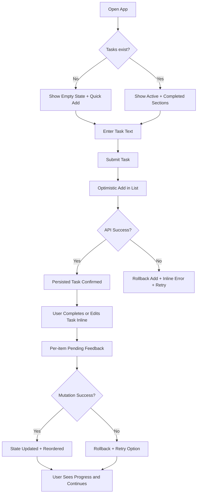
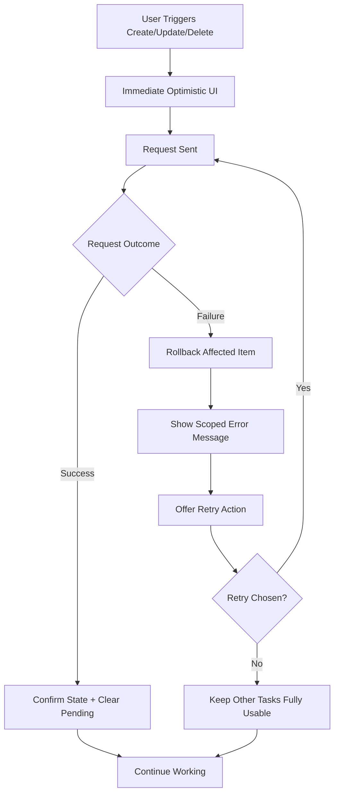

# UX Design Specification todo-app-bmad-agile

**Author:** Raj
**Date:** 2026-03-05

---

<!-- UX design content will be appended sequentially through collaborative workflow steps -->

## Executive Summary

### Project Vision
Build a simplicity-first todo experience that lets users capture and complete tasks quickly, confidently, and without cognitive overload. The UX should feel immediate on first use, while maintaining trust through clear state feedback and reliable persistence.

### Target Users
Primary users are individuals managing personal tasks who prioritize speed, clarity, and low-friction interaction over advanced productivity features. They expect no setup burden and want core actions to be self-evident.

### Key Design Challenges
Create an interface that stays minimal while supporting complete task lifecycle actions in context. Maintain clear success/failure and pending-state feedback under optimistic interactions. Preserve consistent usability and visibility across desktop and mobile form factors.

### Design Opportunities
Deliver instant time-to-value with one-screen task capture and management. Build user trust through transparent action outcomes, rollback clarity, and retry affordances. Use strong visual hierarchy to emphasize actionable tasks and reduce mental load.

## Core User Experience

### Defining Experience
The core experience centers on rapid task capture and frictionless in-list task management. Users should be able to add tasks immediately, understand list status instantly, and complete routine actions without navigation overhead. The interaction model prioritizes speed, clarity, and trust in every mutation.

### Platform Strategy
The product is a responsive web application designed for desktop and mobile browsers. It should support mixed input patterns (keyboard, mouse, touch) while keeping behavior consistent across modern browsers. The UX remains online-first for MVP, with clear system feedback for network-dependent operations.

### Effortless Interactions
Task creation should feel instantaneous through a persistent quick-add control with keyboard-first support. Task updates (complete, uncomplete, edit, delete) should happen directly in list context with per-item pending and error feedback. Ordering and state visibility should reduce cognitive load by default, without extra user configuration.

### Critical Success Moments
The first success moment occurs when a new user adds their first task in seconds with no onboarding. Ongoing success is reinforced when status transitions are obvious and dependable. The make-or-break moment is mutation failure handling: rollback and retry must be transparent and predictable. Trust is completed when refresh/session return always reflects persisted truth.

### Experience Principles
- Optimize for immediate action over feature depth.
- Keep all core workflows in one visible context.
- Make system state and action outcomes unmistakably clear.
- Preserve user trust through consistent, recoverable behavior.

## Desired Emotional Response

### Primary Emotional Goals
The primary emotional objective is to make users feel calm, in control, and confident that their task management is reliable. The experience should reduce cognitive load and reinforce trust through clear, predictable behavior.

### Emotional Journey Mapping
Users should feel immediate clarity on first use, focused momentum during task actions, and accomplishment after completing work. During failures, they should feel informed rather than blocked, with clear recovery paths. On return sessions, they should feel reassured that their data is intact and dependable.

### Micro-Emotions
Critical micro-emotions include confidence over confusion, trust over skepticism, accomplishment over frustration, and satisfaction over anxiety. The product should deliberately avoid ambiguity in state transitions that could erode user trust.

### Design Implications
To support emotional goals, the UI should prioritize one-screen simplicity, explicit state feedback, and low-friction interactions. Mutation actions should provide immediate response with clear outcome messaging, while failure paths should preserve user control through rollback and retry patterns.

### Emotional Design Principles
- Prioritize emotional clarity in every state transition.
- Reinforce trust through transparent and recoverable behavior.
- Create momentum with fast, low-effort task actions.
- Keep the interface calm, focused, and distraction-free.

## UX Pattern Analysis & Inspiration

### Inspiring Products Analysis
For this project context, the most relevant inspiration class is lightweight task tools that emphasize instant entry, clear list hierarchy, and predictable state transitions. The strongest shared UX trait is reducing time-to-first-value: users can add and act on tasks immediately without setup friction. Another high-value trait is confidence signaling through visible pending/success/failure states that prevent ambiguity.

### Transferable UX Patterns
Use persistent quick-add input in primary view to reduce capture friction. Keep in-row actions (complete, edit, delete) to avoid navigation overhead and preserve flow continuity. Apply deterministic list hierarchy (active-first, completed de-emphasized) so users understand priorities at a glance. Use localized feedback (per-item pending/error) instead of global blocking states to maintain momentum.

### Anti-Patterns to Avoid
Avoid feature-heavy controls (tags, filters, prioritization UI) in MVP because they increase cognitive load and conflict with simplicity goals. Avoid ambiguous save behavior (silent failures, unclear pending states) because it erodes trust quickly. Avoid disruptive interaction patterns (full-screen modals for routine edits, global spinners) that interrupt core task flow.

### Design Inspiration Strategy
Adopt minimal, proven patterns that support fast capture and in-context completion. Adapt reliability patterns (optimistic UI plus explicit rollback/retry) to align with your trust-centric emotional goals. Avoid decorative complexity and advanced organization mechanics until core behavior is validated in real usage.

## Design System Foundation

### 1.1 Design System Choice
Themeable system using utility-first foundation: Tailwind CSS with a small curated component layer.

### Rationale for Selection
This gives the best speed-versus-flexibility balance for the MVP. It supports a minimal visual language, fast iteration, and easy responsive behavior without forcing a heavy pre-styled component system. It also aligns with clear state styling needs (active/completed/pending/error) and low long-term maintenance overhead.

### Implementation Approach
Establish base design tokens (spacing, typography scale, semantic states) in Tailwind config, then implement focused components for quick-add input, task row, state messages, and action controls. Keep components shallow and feature-scoped to preserve simplicity and avoid design-system overbuild in v1.

### Customization Strategy
Apply a restrained visual identity emphasizing clarity and hierarchy over ornamentation. Customize only what supports core usability: state colors, spacing rhythm, interactive feedback, and mobile responsiveness. Defer advanced theming or brand variants until core behavior is validated.

## 2. Core User Experience

### 2.1 Defining Experience
The defining interaction is “capture and progress in one flow”: users add a task instantly, then complete, edit, or remove it directly in the same list context. The value is immediate control with minimal cognitive friction and no navigation overhead.

### 2.2 User Mental Model
Users think in short, actionable reminders and expect a todo app to behave like a dependable external memory. They expect instant add, clear done/not-done status, and persistence they can trust after refresh. Friction appears when systems hide state, delay feedback, or scatter actions across multiple views.

### 2.3 Success Criteria
The core interaction succeeds when users can add tasks in seconds, manage each item inline, and always understand action outcomes. Success signals include immediate visual response, explicit pending/failure states, and consistent post-refresh data integrity.

### 2.4 Novel UX Patterns
The experience uses mostly established patterns (list, quick-add, and inline actions) for zero learning burden, with a focused twist: consistent optimistic feedback and deterministic rollback/retry as a trust-building behavior model. This combines familiarity with reliability clarity.

### 2.5 Experience Mechanics
Initiation: persistent quick-add input invites immediate capture.
Interaction: user submits text, then performs complete/edit/delete directly on each row.
Feedback: per-item pending indicators, explicit success/failure messaging, rollback on failed mutation.
Completion: item state updates clearly in list hierarchy; user sees progress and can immediately continue with next task.

## Visual Design Foundation

### Color System
Use a clarity-first neutral palette with strong semantic states: neutral tones for structure and readability, one restrained primary accent for key actions, and explicit success/warning/error colors for outcomes. Keep completed-task styling visibly de-emphasized while preserving legibility. Prioritize high-contrast combinations for fast status scanning.

### Typography System
Use a modern sans-serif stack optimized for UI readability and scanning speed. Establish a simple hierarchy (title, section heading, body, microcopy) with consistent line-height and weight progression. Keep copy concise and action-oriented to support rapid task workflows.

### Spacing & Layout Foundation
Apply an 8px spacing system with compact but breathable density. Maintain a single-column primary flow on mobile and a centered constrained-width layout on desktop. Preserve consistent vertical rhythm between quick-add, task rows, and state messaging.

### Accessibility Considerations
Meet contrast baselines across all semantic states, keep all core interactions keyboard-operable, and provide visible focus indicators. Ensure pending, success, and error states are never communicated by color alone, and preserve semantic structure for list and action controls.

## Design Direction Decision

### Design Directions Explored
Six direction variants were explored across minimal, dense, and calm approaches using the clarity-first neutral palette. Variations tested hierarchy weight, row density, input prominence, and feedback styling.

### Chosen Direction
Primary baseline is Direction 1 (Balanced Minimal), with selective adoption of Direction 6 sticky-input flow and Direction 4 trust-feedback cues.

### Design Rationale
This combination best supports instant capture, low cognitive load, and clear action outcomes while preserving a calm visual tone. It aligns with MVP simplicity and reduces implementation complexity.

### Implementation Approach
Start with a balanced single-column layout and moderate spacing, then apply persistent quick-add and per-item state messaging patterns. Keep component primitives minimal and feature-scoped for rapid delivery.

## User Journey Flows

### Journey 1: Fast Capture and Completion
Goal: user captures tasks instantly and manages them inline without leaving the main screen.

### Journey 2: Failure Recovery and Trust Preservation
Goal: user understands failed operations clearly and recovers without disrupting other work.

### Journey Patterns
- One-screen task lifecycle with persistent quick-add entry point.
- Per-item action scope for pending and error feedback (no global lock).
- Deterministic state reconciliation to server truth after mutations and reload.
- Active-first hierarchy with de-emphasized completed tasks for fast scanning.

### Flow Optimization Principles
- Minimize steps to first success (first task in seconds).
- Keep decisions local to the affected task row.
- Make progress and failure states explicit and recoverable.
- Preserve momentum by isolating failures from unrelated actions.

## Component Strategy

### Design System Components
Using Tailwind as the foundation, base components include buttons, inputs, text styles, containers/cards, badges, inline alerts, and focus states. These cover structural UI and common controls for the todo flow.

### Custom Components

### QuickAddBar
**Purpose:** Instant task capture with minimal friction.
**Usage:** Always visible at the top of the main task view.
**Anatomy:** Input field, submit action, inline validation/error text.
**States:** Default, focused, submitting, validation error, API failure.
**Accessibility:** Labeled input, Enter submit, keyboard focus retention.

### TaskRow
**Purpose:** Represent one task with inline lifecycle actions.
**Usage:** In active and completed sections.
**Anatomy:** Status toggle, description text, metadata, action buttons.
**States:** Active, completed, pending mutation, error, disabled-per-action.
**Accessibility:** Semantic list row, keyboard-operable actions, explicit status text.

### TaskStatePanel
**Purpose:** Communicate empty, loading, and error states clearly.
**Usage:** List-level fallback/status UI.
**Anatomy:** Title, short guidance copy, optional retry action.
**States:** Empty, loading, error.
**Accessibility:** Polite/live region usage for dynamic status updates where appropriate.

### InlineActionFeedback
**Purpose:** Provide scoped feedback for mutation outcomes per item.
**Usage:** Attached to affected task row/action.
**Anatomy:** Message text with retry affordance.
**States:** Hidden, pending, error, resolved.
**Accessibility:** Non-color-only signaling with screen-reader-friendly messaging.

### Component Implementation Strategy
Use design tokens from the visual foundation (neutral palette, 8px spacing, type scale) and keep components feature-scoped to avoid over-engineering. Prefer composition over inheritance and maintain separation between presentational components and data/mutation hooks.

### Implementation Roadmap
- Phase 1 (critical): QuickAddBar, TaskRow, TaskStatePanel.
- Phase 2 (reliability UX): InlineActionFeedback and per-item pending states.
- Phase 3 (polish): Metadata formatting refinements and responsive tuning.

## UX Consistency Patterns

### Button Hierarchy
Primary buttons are reserved for the single highest-value action in context (typically add/confirm). Secondary buttons handle non-destructive alternatives, while tertiary/text actions support low-emphasis controls. Destructive actions are visually distinct and require clear labeling.

### Feedback Patterns
Use scoped, contextual feedback: per-item pending and error messages for task mutations, list-level feedback for fetch/loading states, and concise success confirmation where ambiguity exists. Error messages always include a recovery path (retry/cancel/revert).

### Form Patterns
Keep forms minimal and inline where possible (quick-add and inline edit). Validate early for required text constraints and validate definitively on submit. Preserve user input on recoverable failures and return focus predictably after actions.

### Navigation Patterns
Default to a single-screen workflow with no deep navigation for core task actions. Maintain stable placement for quick-add, active/completed groupings, and task actions to reduce relearning. Avoid modal detours for routine operations.

### Additional Patterns
Empty/loading/error states use consistent structure: clear title, short explanation, and next action. Pending states are localized, not global, to keep unaffected tasks interactive. Completed tasks are de-emphasized but accessible, preserving visibility without competing with active work.

## Responsive Design & Accessibility

### Responsive Strategy
Use a mobile-first single-flow layout that preserves quick-add and inline task actions across all devices. On desktop, increase breathing room and constrain content width for scanability rather than introducing complex multi-pane navigation. On tablet, keep touch-friendly controls with the same interaction model to avoid behavioral drift.

### Breakpoint Strategy
Use standard breakpoints with minor tuning for readability:
- Mobile: 320–767px
- Tablet: 768–1023px
- Desktop: 1024px+
Prioritize behavior consistency across breakpoints; adapt spacing and density before changing interaction patterns.

### Accessibility Strategy
Target WCAG AA as baseline. Enforce contrast-safe semantic states, full keyboard operability for create/edit/complete/delete/retry flows, visible focus indicators, and semantic list/form structure. Ensure touch targets are at least 44x44px and all status messages include non-color cues.

### Testing Strategy
Run responsive checks on real devices and major browsers (Chrome, Firefox, Safari, Edge). Use automated accessibility linting plus manual keyboard-only passes and VoiceOver testing. Validate failure-state messaging and focus behavior after retries and inline edits.

### Implementation Guidelines
Implement with semantic HTML, predictable focus management, and localized ARIA/live-region usage for dynamic feedback. Use relative sizing and mobile-first CSS rules; avoid fixed-width assumptions. Keep loading/error/empty patterns structurally consistent so assistive technologies receive predictable output.
